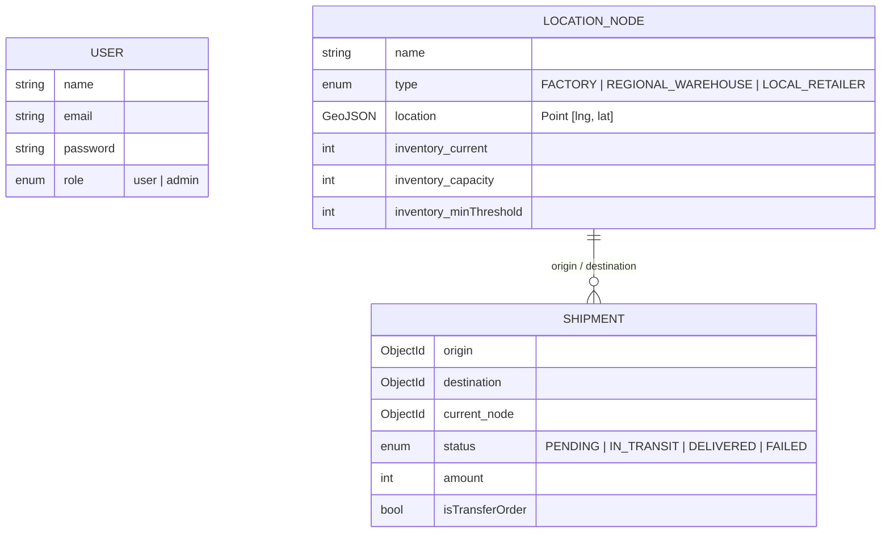

# 🏭 Supply Chain Orchestrator

A **full-stack multi-regional supply chain management system** built with the MERN stack. Features an intelligent **automated rebalancing engine** that detects inventory deficits across the network and autonomously generates optimal transfer orders using geospatial nearest-neighbor matching — no manual intervention required.


---

## ✨ Key Features

### 🧠 Intelligent Rebalancing Engine
The core algorithmic feature — a global network optimizer that runs in a single pass:

1. **Scan** — Identifies all deficit warehouses (`stock < minThreshold`) and surplus warehouses (`stock > minThreshold`)
2. **Match** — For each deficit node, builds a distance-sorted candidate list of surplus donors using the **Haversine formula** (great-circle distance in km)
3. **Guard** — Before transferring, validates that the donor won't drop below its own safety threshold
4. **Multi-Donor** — If the nearest node can't donate enough, pulls from the next nearest, and so on
5. **Deduplicate** — Skips deficit nodes that already have in-flight shipments to prevent oversupply
6. **Repeat** — Continues until all warehouses are balanced or no valid transfers remain

> The engine executes as a single `POST /api/rebalance` call and returns structured logs for full auditability.

### 🗺️ Interactive Geospatial Dashboard
- Live map powered by **React-Leaflet** with node markers and color-coded status
- KPI stat cards showing total nodes, active shipments, system inventory, and critical alerts
- Recent shipments feed with real-time status tracking

### 🔐 JWT Authentication & RBAC
- Secure login with **bcrypt** password hashing and **JWT** token-based auth
- **Role-Based Access Control** — Admin vs User roles
- Admin-only operations: create/edit nodes, run rebalancer, mark shipments as delivered
- Protected API routes with middleware guards

### 🌓 Dark / Light Mode
- System-aware theme toggle with smooth transitions
- Glassmorphism-inspired UI with backdrop blur and layered surfaces
- Fully responsive across all screen sizes

---

## 🏗️ Architecture

```
Supply-Chain-Orchestrator/
├── Server/                          # Express.js REST API
│   └── src/
│       ├── app.js                   # Entry point, middleware, route mounting
│       ├── config/
│       │   └── db.js                # MongoDB connection (Mongoose)
│       ├── models/
│       │   ├── LocationNode.js      # GeoJSON Point + inventory schema
│       │   ├── Shipment.js          # Transfer order tracking
│       │   └── User.js              # Auth with bcrypt pre-save hooks
│       ├── controllers/
│       │   ├── nodeController.js    # CRUD for supply chain nodes
│       │   ├── shipmentController.js# Shipment lifecycle + delivery trigger
│       │   ├── inventoryController.js# Inventory updates + auto-rebalance
│       │   └── authController.js    # Register / Login / JWT issuance
│       ├── services/
│       │   └── rebalanceService.js  # 🧠 Global rebalancing algorithm
│       ├── middlewares/
│       │   └── authMiddleware.js    # JWT verify + admin gate
│       └── routes/                  # RESTful route definitions
│
├── client/                          # React 19 + Vite SPA
│   └── src/
│       ├── pages/
│       │   ├── Dashboard.jsx        # KPI cards + Map + Recent Shipments
│       │   ├── Nodes.jsx            # Node management grid
│       │   ├── Shipments.jsx        # Shipment table + Rebalancer UI
│       │   └── Login.jsx            # Auth page
│       ├── components/
│       │   ├── Sidebar.jsx          # Navigation sidebar
│       │   ├── Navbar.jsx           # Top bar with theme toggle + user info
│       │   ├── StatCard.jsx         # Animated KPI cards
│       │   ├── MapWidget.jsx        # Leaflet map wrapper
│       │   └── Modal.jsx            # Reusable modal
│       ├── context/
│       │   ├── AuthContext.jsx      # JWT state + login/logout
│       │   └── ThemeContext.jsx     # Dark/light persistence
│       └── services/
│           └── api.js               # Axios instance with auth interceptor
```

---

## 📊 Data Model



---

## 🧠 Rebalancing Algorithm — Deep Dive

```
┌──────────────────────────────────────────────────────────┐
│                  GLOBAL REBALANCE ENGINE                  │
├──────────────────────────────────────────────────────────┤
│                                                          │
│  1. FETCH all nodes from DB                              │
│  2. CLASSIFY                                             │
│     ├── Deficit:  current < minThreshold                 │
│     └── Surplus:  current > minThreshold                 │
│  3. BUILD live surplus tracker Map (donor → spare units) │
│  4. FOR EACH deficit node:                               │
│     ├── Skip if in-flight shipments exist                │
│     ├── Compute target = 50% of capacity                 │
│     ├── needed = target - current                        │
│     ├── Sort surplus nodes by Haversine distance (ASC)   │
│     └── WHILE needed > 0 AND donors remain:             │
│         ├── Take min(donor_surplus, needed)               │
│         ├── Re-verify donor from DB (race condition safe) │
│         ├── Create IN_TRANSIT transfer shipment           │
│         ├── Deduct from donor inventory immediately       │
│         └── Update live surplus tracker                   │
│  5. RETURN structured audit logs                         │
│                                                          │
└──────────────────────────────────────────────────────────┘
```

**Key guarantees:**
- ✅ No donor drops below its own safety threshold
- ✅ No duplicate shipments to the same deficit node
- ✅ Multi-donor support: if Node A can't fill the gap, Node B chips in
- ✅ Race-condition safe: re-fetches donor state from DB before deducting
- ✅ Proper Haversine distance (not Euclidean approximation)

---

## 🔌 API Reference

### Auth
| Method | Endpoint | Auth | Description |
|--------|----------|------|-------------|
| `POST` | `/api/auth/register` | — | Register new user |
| `POST` | `/api/auth/login` | — | Login, receive JWT |

### Nodes
| Method | Endpoint | Auth | Description |
|--------|----------|------|-------------|
| `GET` | `/api/nodes` | `Bearer` | List all nodes |
| `GET` | `/api/nodes/:id` | `Bearer` | Get single node |
| `POST` | `/api/nodes` | `Admin` | Create node |
| `PUT` | `/api/nodes/:id` | `Admin` | Update node |
| `DELETE` | `/api/nodes/:id` | `Admin` | Delete node |

### Shipments
| Method | Endpoint | Auth | Description |
|--------|----------|------|-------------|
| `GET` | `/api/shipments` | `Bearer` | List all shipments |
| `POST` | `/api/shipments` | `Admin` | Create manual shipment |
| `PUT` | `/api/shipments/:id/status` | `Admin` | Update status (delivery triggers rebalance) |

### Inventory
| Method | Endpoint | Auth | Description |
|--------|----------|------|-------------|
| `GET` | `/api/inventory/:nodeId` | `Bearer` | Get node inventory |
| `POST` | `/api/inventory/update` | `Admin` | Update inventory (triggers rebalance) |

### Rebalancer
| Method | Endpoint | Auth | Description |
|--------|----------|------|-------------|
| `POST` | `/api/rebalance` | `Admin` | **Run global rebalance engine** |
| `POST` | `/api/rebalance/:nodeId` | `Admin` | Trigger rebalance for single node |

---

## 🚀 Getting Started

### Prerequisites
- **Node.js** ≥ 18
- **MongoDB** (local or Atlas connection string)

### 1. Clone the repository

```bash
git clone https://github.com/aadiakshat/Supply-Chain-Orchestrator.git
cd Supply-Chain-Orchestrator
```

### 2. Setup the backend

```bash
cd Server
npm install
```

Create a `.env` file in the `Server/` directory:

```env
PORT=5000
MONGO_URI=mongodb+srv://<username>:<password>@cluster.mongodb.net/supply-chain
JWT_SECRET=your_jwt_secret_here
```

Start the server:

```bash
npm run dev          # Development (nodemon)
npm start            # Production
```

### 3. Setup the frontend

```bash
cd client
npm install
npm run dev
```

The app will be available at `http://localhost:5173`

### 4. Seed an admin user

Register via the API or use the app's registration flow. To make a user an admin, update their role directly in MongoDB:

```js
db.users.updateOne({ email: "admin@example.com" }, { $set: { role: "admin" } })
```

---

## 🛠️ Tech Stack

| Layer | Technology | Purpose |
|-------|-----------|---------|
| **Runtime** | Node.js 18+ | Server-side JavaScript |
| **Framework** | Express.js | REST API routing & middleware |
| **Database** | MongoDB + Mongoose | Document store with GeoJSON indexing |
| **Auth** | JWT + bcryptjs | Stateless authentication & password hashing |
| **Frontend** | React 19 + Vite | SPA with fast HMR |
| **Styling** | Tailwind CSS v4 | Utility-first CSS with custom dark mode variant |
| **Maps** | Leaflet + React-Leaflet | Interactive geospatial visualization |
| **Icons** | Lucide React | Consistent icon system |
| **HTTP** | Axios | API client with auth interceptors |

---

## 📝 License

This project is open source and available under the [ISC License](LICENSE).
